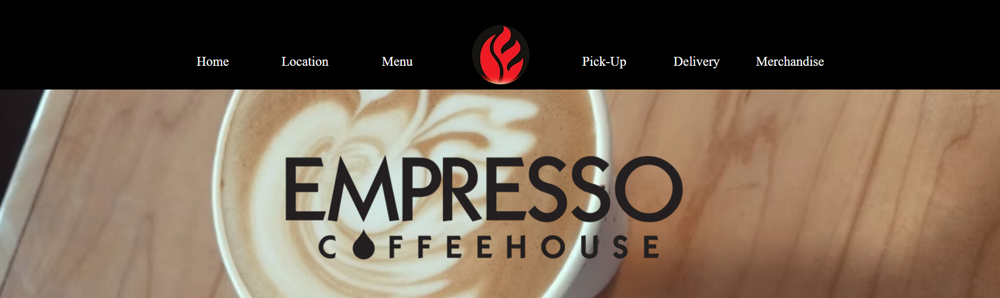

# Business-Redesign-Empresso-Coffee-House

**Description**: Took a local business and did a redesign to their existing site. This redesign improved their site and made it more up to date.

**Name**: Santiago Montanez, Brock Spacek, Michael Heckerman

**Date**: 11/22/24

**Original Site**: https://www.empressocoffeehouse.com/

**Figma**: https://www.figma.com/design/acAkkaV22o0hgckLFJVbNo/Business-Redesign?node-id=0-1&node-type=canvas&t=jGKDvPnYqrfx7iXb-0

**Github**: https://github.com/santimm44/Business-Redesign-Empresso-Coffee-House

**Vercel**: https://business-redesign-empresso-coffee-house.vercel.app/

### Peer Review:
**Name**: Karen Cadavos, Thao Vhang & David Monterrosa

**Comments**: 

Home
1.Link sizes could be bigger (Figma user bigger font it looks like)
2.Espresso logo name needs to be centered across the header.
3.For usability, the page  banner labels should be removed or replaced. It is confusing as the navigation links are the same look. It can be mistaken as another header link. Instead of “home” use “Welcome to our {insert something}” , same for Location page , you can use “Find us at”
4.Good use of target =new for external links on the header (Pick up , delivery , mechandise)
5.Cool use of logo animation when clicked!

Menu	
1. Menu page - the link to the pick up website is broken.  Also color of the link is off. It is color blue and does not go with the theme of the website
2. For menu subsection headers (i.e. empresso, fruit smoothies ) you can just put it inside the subsection container for readability to know that is is part of that sub-menu.
3. Pour Over coffee- typo . We see extra price line.
4. Subsection containers could use a little bit of top padding

Mobile responsiveness

1. Good use of accordion however the accordion header color (blue)could be changed to fit the color theme of the website .
2. Some of the 2nd level accordion items doesn’t have a description . You should get rid of the buttons for those. 
3.Fruit smoothie items doesn’t have the prices and is not consistent to other menu items.
4. Some of the accordion body text in red doesn't seem to fit well with the theme and could be misunderstood as a link since it is underlined. Change it to black or something similar to the theme of the website.
   
